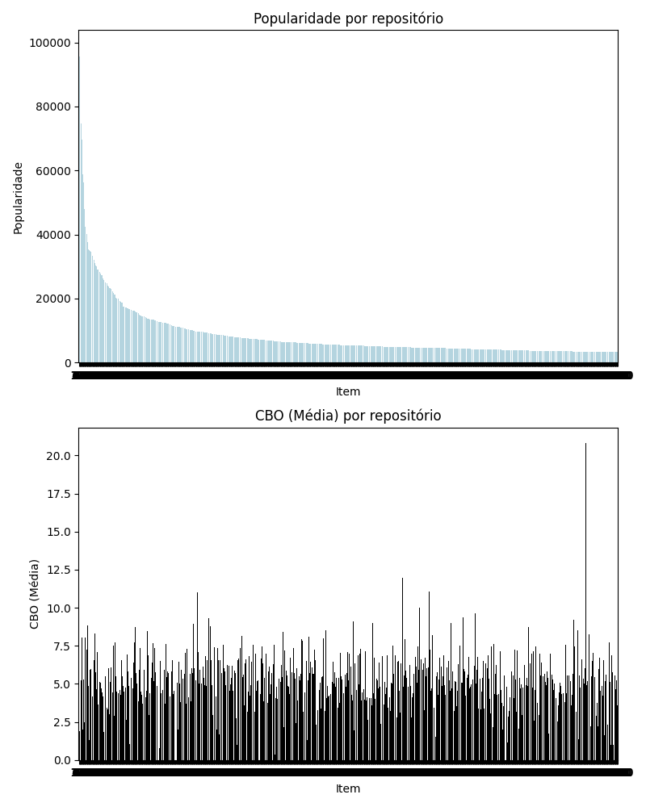
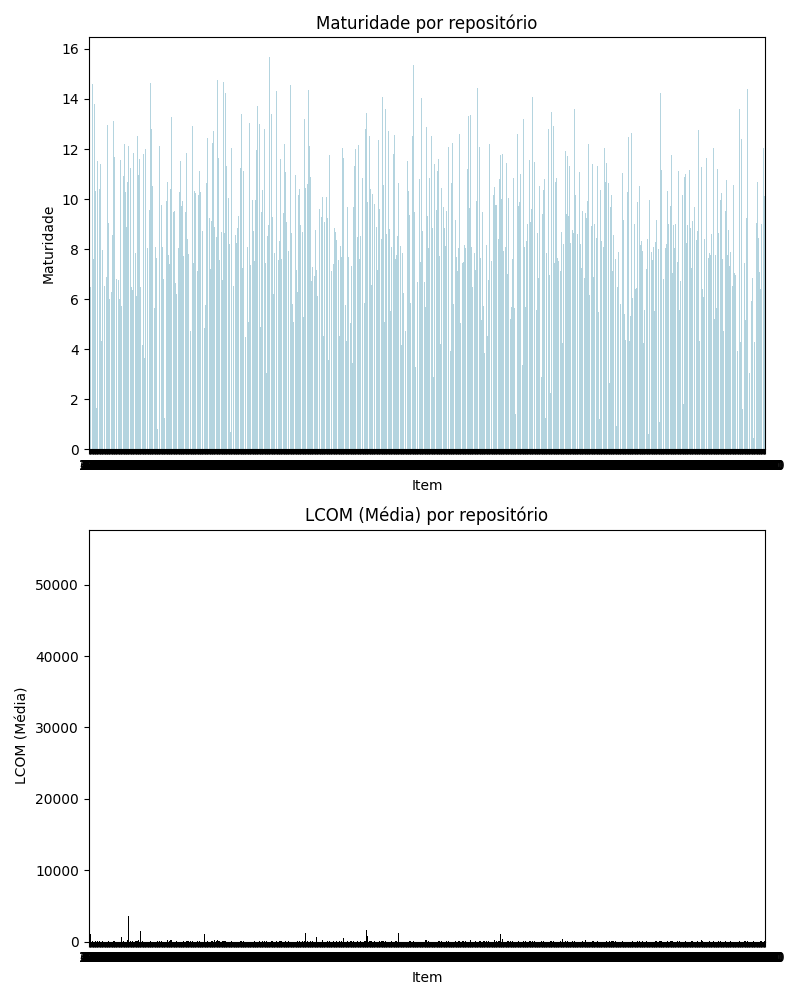

# LAB 2 -  Análise dos 1000 repositórios mais populares de Java do Github

## i. Introdução

Neste trabalho são analisados os 1000 repositórios mais populares da linguagem Java disponíveis no Github, sendo estes ordenados de acordo com a sua quantidade de *stars*. O intuito é observar padrões entre estes repositórios, que por sua vez possuem uma grande variedade de propósitos, podendo se tratar de sistemas *open source*, projetos *boilerplate*, bibliotecas, e estes são apenas alguns dos exemplos do que pode ser encontrado dentre os repositórios analisados.

## ii. Metodologia

Para realizar este trabalho foi criado um algoritmo que realiza a busca dos 1000 repositórios mais populares do Github utilizando sua interface GraphQL. A busca é dividida em 25 páginas de 40 itens cada, sendo cada requisição realizada com um intervalo arbitrário de 4 segundos entre cada uma. Cada uma das páginas de resultados é acrescentada a uma lista, e assim que a obtenção dos dados é finalizada com sucesso é criado um arquivo `github_repositories_data.csv` contendo estes dados.

Após obter estes dados, é executado o script `clone_repos.py` para realizar a clonagem de cada um dos repositórios encontrados no passo anterior. Após isso, é executado o script `generate_summarized_data`, que realiza as operações necessárias para obter o valor total de cada uma das métricas (DIT, CBO, LCOM), assim como as suas respectivas médias, medianas e também o desvio padrão. Durante essa etapa, repositórios que possuem valor 0 para as métricas DIT, CBO, LCOM e LOC são desconsiderados, por se tratarem de repositórios que não possuem código Java, sendo os IDs destes repositórios salvos no arquivo `empty_repos.txt`.

Por fim, é executado o script `generate_stats.py`, que realiza a geração dos gráficos para as RQs 1, 2, 3 e 4 considerando cada uma das métricas de processo e qualidade.

## iii. Resultados

### RQ 01. Qual a relação entre a popularidade dos repositórios e as suas características de qualidade?

#### CBO
  

#### DIT
  

#### LCOM
  

R: Pela analise realizada é possível dizer que não há grande correlação entre a popularidade de um repositório e suas caracteristicas de qualidade, pois de forma geral é possível ver uma distribuição equilibrada dos valores das métricas análisadas desde os repositórios mais populares até aos repositórios menos populares. 

### RQ 02. Qual a relação entre a maturidade do repositórios e as suas características de qualidade?

#### CBO
  

#### DIT
  

#### LCOM
  

R: Pela analise realizada é possível interpretar que repositórios de maior longevidade possuem métricas superiores, onde vemos por exemplo na métrica DIT valores mais preocupantes sendo associados a repositórios criados mais recentemente. 

### RQ 03. Qual a relação entre a atividade dos repositórios e as suas características de qualidade?

#### CBO
  

#### DIT
  

#### LCOM
  

R: Pela analise realizada é possível notar repositórios com menor atividade possuindo maior indice de acoplamento entre objetos. Já para os dados de LCOM e DIT não é possível estabelecer uma correlação entre o repositório ter maior nivel de atividade com possuir melhores métricas.

### RQ 04. ual a relação entre o tamanho dos repositórios e as suas características de qualidade?

#### CBO
  

#### DIT
  

#### LCOM
  

R: Pela analise realizada é possível notar alguma correlação entre projetos de maior tamanho possuirem maior indice de acoplamento e menor nível de coesão.

## iv. Conclusão

Inicialmente, foi considerada a hipótese de que repositórios mais populares apresentariam métricas mais positivas de forma geral, o que não se mostrou o caso após realizar a coleta e análise dos dados dos 1000 repositórios em questão. 

Neste caso o que mais surpreendeu foi o ponto de que, de maneira geral, as métricas se apresentam de forma bem distribuida desde os repositórios mais populares até os menos populares, onde por exemplo é possível ver repositórios dentre os menos populares apresentando ótimas métricas com relação a acoplamento.